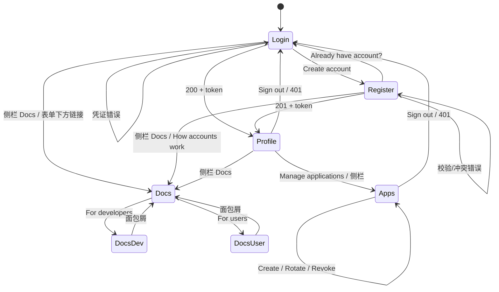
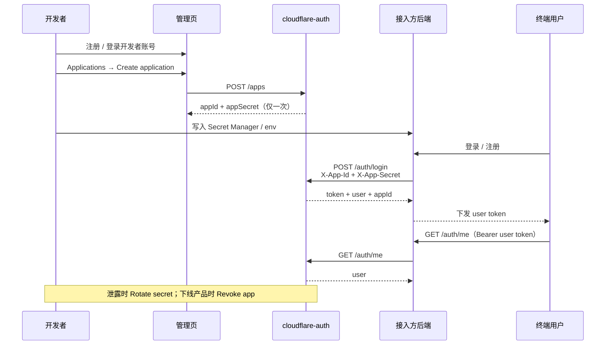
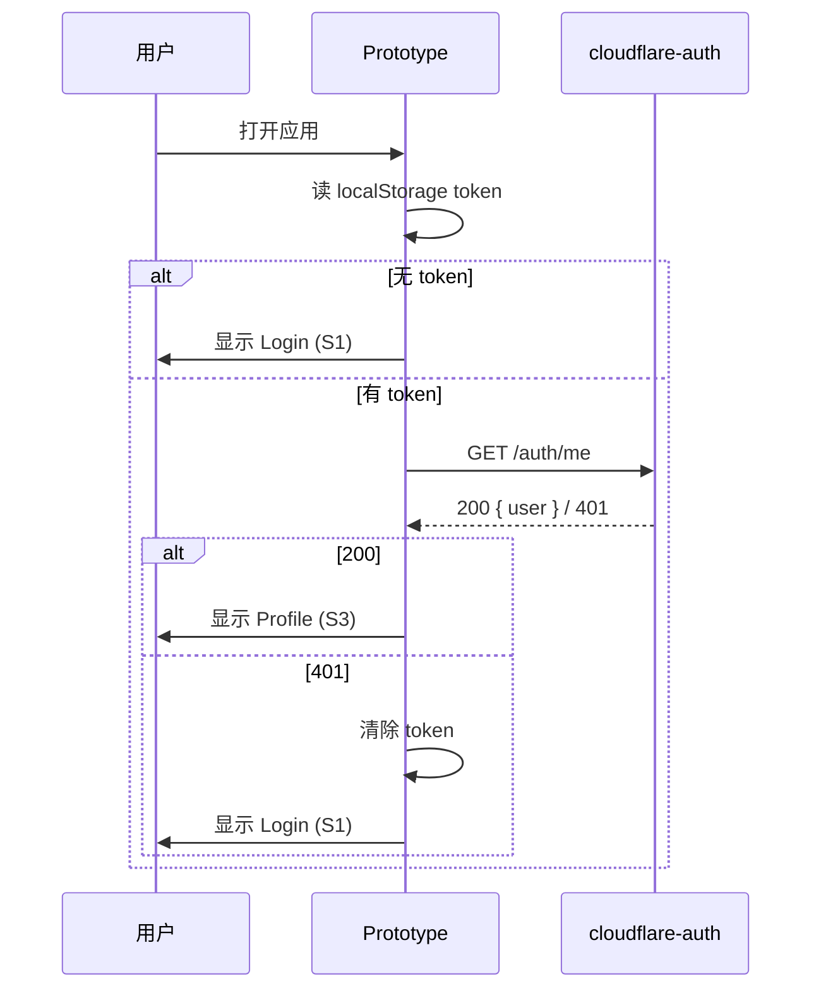
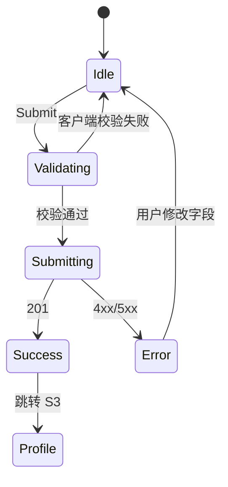

# cloudflare-auth · UI 交互图

**方向**：Quiet Utility · 1440 桌面  
**屏幕**：Login / Register / Profile / Docs（入口 · 开发者 · 用户）

---

## 1. 页面流转



---

## 1.5 AppID 接入流程



| 步骤 | 操作 | 结果 |
|------|------|------|
| 1 | 开发者注册/登录 | 可管理 Applications |
| 2 | Create application | 获得 `app_…` + 一次性 `sec_…` |
| 3 | 服务端存凭证 | Secret 不进前端/仓库 |
| 4 | 带双 Header 调 register/login | 会话绑定该 App |
| 5 | 用 user token 调 /me /logout | 终端用户会话 |
| 6 | rotate / revoke | 轮换密钥或阻断接入 |

**凭证边界**

| 角色 | 持有 | 禁止 |
|------|------|------|
| 开发者 | 账号密码；申请/轮换/吊销 App | 把 Secret 发给终端用户 |
| 接入方后端 | `APP_ID` + `APP_SECRET` | 把 Secret 打进前端/移动端包 |
| 终端用户 | 账密；user token | 访问 App Secret |

**UI 文档页**（Docs → For developers → App ID integration guide）包含：四步流程条、角色卡、分步 curl/Node 示例、凭证排错表。

---

## 2. 会话校验时序（进入 Profile）



---

## 3. 注册表单状态机



| 状态 | UI |
|------|-----|
| Idle | 表单可编辑，按钮可点 |
| Validating | 即时行内错误（邮箱/用户名/密码） |
| Submitting | 按钮 loading + disabled |
| Error | 表单顶部错误条（冲突/服务器） |
| Success | 进入 Profile |

---

## 4. Login 交互规格（S1）

```
┌────────────┬────────────────────────────────────────┐
│  ☁ brand   │                                        │
│            │   Welcome back                         │
│            │   Sign in to cloudflare-auth           │
│            │                                        │
│            │   Email                                │
│            │   [ name@example.com            ]      │
│            │   Password                             │
│            │   [ ••••••••                    ]      │
│            │                                        │
│            │   [        Sign in         ]  (accent) │
│            │   New here? Create an account          │
│            │                                        │
│            │   ⚠ Invalid email or password          │
└────────────┴────────────────────────────────────────┘
```

| 元素 | 行为 |
|------|------|
| Email | blur 校验格式；失败红字 |
| Password | 必填；不在此暴露策略（登录不校验长度） |
| Sign in | 提交 → loading；成功写 token → Profile |
| Create an account | 切到 S2，保留已填 email（若有） |
| 错误条 | 401 时出现；焦点回到 Password |

---

## 5. Register 交互规格（S2）

| 字段 | 规则 | 错误文案 |
|------|------|----------|
| Email | RFC 简式 | Email is invalid |
| Username | `^[A-Za-z0-9_]{3,32}$` | 3–32 letters, numbers, underscore |
| Password | ≥8 | Password must be at least 8 characters |
| Confirm | 与 Password 一致 | Passwords do not match |

- 主 CTA：Create account（accent 实心）  
- 次链：Already have an account? Sign in  
- 409：顶部 `Email or username already taken`

---

## 6. Profile 交互规格（S3，对齐源视觉）

```
┌────────────┬────────────────────────────────────────┐
│  ☁ cloudflare-auth                     Sign out ↗ │
│            │  Profile                               │
│            │  Your account and session details.     │
│            │  ─────────────────────────────────     │
│            │  ✉ Email              alice@example.com│
│            │  👤 Username          alice            │
│            │  📅 Created           2026-09-17       │
│            │  🕐 User ID           usr_…            │
│            │                                        │
│            │  Session status                        │
│            │  (● Active · Expires in 24h)           │
│            │  This session will expire at …         │
│            │                                        │
│            │  API Base URL                          │
│            │  Your authentication API base URL      │
│            │  [ https://api…/v1           ] [copy]  │
│            │  Regenerating your token will…         │
│            │  [ ⭑ Regenerate token ]                │
│            │  [ ⧉ Copy API Base URL ]  (accent)     │
└────────────┴────────────────────────────────────────┘
```

| 控件 | 交互 |
|------|------|
| 定义列表行 | 静态；ID/日期 mono |
| Active 胶囊 | 绿点 + 文案；不可点 |
| 复制图标 | clipboard API；1.5s 显示 “Copied” |
| Regenerate token | 次要按钮；原型弹确认后 toast「Token regenerated」 |
| Copy API Base URL | 主 CTA；同复制行为 + Copied 反馈 |
| Sign out | `POST /auth/logout` → 清 token → Login |

---

## 7. Applications 交互规格（S7）

```
┌────────────┬────────────────────────────────────────┐
│  ☁ brand   │  Applications                         │
│  Account   │  Apply for an App ID…                 │
│  Docs      │                                        │
│  Apps   ●  │  [ ✓ App created · secret once ]      │
│            │  Register a new app                    │
│            │  App name [                    ]       │
│            │  Description [                 ]       │
│            │  [ Create application ]                │
│            │  Your apps                             │
│            │  Acme · Active                         │
│            │  app_xxx…              [Copy]          │
│            │  [Rotate secret] [Revoke]              │
└────────────┴────────────────────────────────────────┘
```

| 控件 | 交互 |
|------|------|
| Create application | 校验名称 → 生成 App ID + Secret → 列表插入 + 绿色一次性 Secret 条 |
| Copy App ID | clipboard；toast「App ID copied」 |
| Copy secret | 仅在 Secret 条可见时可用 |
| Rotate secret | 旧 Secret 立即失效；条文案改为 rotated |
| Revoke | confirm 后置灰；App 不可再用于接入 |
| Sign out | 清空本地 apps mock；Applications 入口隐藏 |

侧栏 **Applications** 仅登录后可见。

---

## 8. Docs 交互规格（S4–S6）

```
┌────────────┬────────────────────────────────────────┐
│  ☁ brand   │  Documentation                        │
│  Account   │  Choose the guide that matches…        │
│  Docs  ●   │                                        │
│            │  ┌─ For developers ─┐ ┌─ For users ─┐ │
│            │  │ API & integration│ │ Account &   │ │
│            │  │ …                │ │ sessions    │ │
│            │  │ Open docs →      │ │ Open guide →│ │
│            │  └──────────────────┘ └─────────────┘ │
└────────────┴────────────────────────────────────────┘
```

| 控件 | 交互 |
|------|------|
| 侧栏 Docs | 进入文档首页（任意登录态均可） |
| 登录页 “Read the docs” | 直达 Docs 入口 |
| 注册页 “How accounts work” | 直达用户指南 |
| 身份卡片 | 开发者 → API 参考；用户 → 账户指南 |
| 面包屑 Docs | 返回文档首页 |
| 侧栏 Account | 已登录回 Profile，未登录回 Login |

文档页为纯静态阅读，无提交按钮；侧栏 Docs 高亮当前所在文档区域。

---

## 9. 全局反馈

| 类型 | 位置 | 时长 |
|------|------|------|
| 字段错误 | 输入下方 | 直到修复 |
| 表单错误 | 表单顶部 | 直到再次提交 |
| 复制成功 | 按钮旁 / 按钮内 | 1500ms |
| Toast | 视口右上 | 2500ms |

**Loading**：主按钮宽度保持，内部 spinner，防双击。  
**Focus**：2px accent ring，不依赖颜色以外线索。

---

## 10. 响应式

| 断点 | 行为 |
|------|------|
| ≥960px | 侧栏 220px + 主内容 |
| &lt;960px | 侧栏收成顶栏品牌行；Sign out 右上 |
| &lt;480px | 定义列表改为上下堆叠 |
